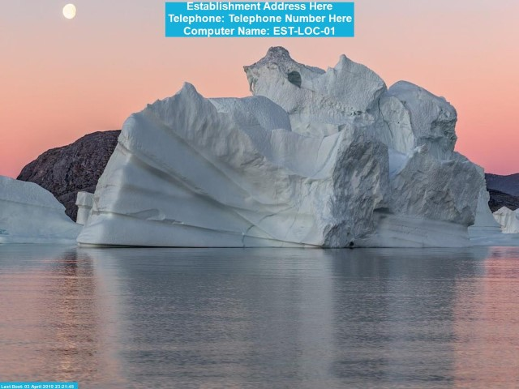

# Boot and Logon wallpaper generation using PowerShell.
This repository contains code to generate Boot and Logon wallpapers using existing wallpaper and adding an overlay of text which can display your Establishment name/address, computer name, etc via PowerShell scripts.

Examples of this style can be found below:

**Boot** 

**Logon** 

For this exercise we are going to use some Windows Spotlight wallpapers for Windows 10 in 19x6 (aka Widescreen) and 4x3 (aka Standard) resolutions, which can be [downloaded here](https://drive.google.com/open?id=1Sr4ZWIJtStYvWMOky2gFNi6r78Lp3wY4).

Extract the zip file to a folder with the Establishment’s name. So, the folder path to both directories should be: 
Establishment\Wallpaper\4x3 
Establishment\Wallpaper\19x6

There are around 280MB worth of images, so you may want to delete some if your machines don’t have much space. After you have finished, copy the Establishment directory to your Domain Controller’s netlogon share (i.e. `\\FQDN\netlogon` - where FQDN is the fully qualified domain name for your active directory domain).

I suggest putting the scripts in `\\FQDN\netlogon` or the script folder for the relevant GPOs.

## Update Wallpaper (Update Wallpapers.ps1)

When running the script as an Administrator, you should find this will copy the Establishment folder down from the netlogon share to the `C:\Program Files` folder on the local computer.

To ensure the script is run as admin on bootup we will need to create or amend a Group Policy Object (GPO) targeting the computer:

Go to Computer Configuration -> Policies -> Windows Settings -> Scripts (Logon/Logoff) -> Logon, and then click on the PowerShell Scripts tab, press Add, and for the script name type in the full path you stored the Update Wallpapers script (i.e. `\\FQDN\netlogon\Update Wallpapers.ps1`).

## Boot Info (Boot Info.ps1)

Edit the section after '$TextLabel = "' to change the text which is saved on the wallpaper.
Rename Establishment in the script to the actual Establishment Name/Address.

Note: This script has an option to set one specific image as the boot background rather than selecting a random one from the folders, just name the file Override.jpg in the `Establishment\Wallpaper` folder on the local machine. This script also creates the registry key `HKLM:\Software\MachineData` and provides Authenticated Users write access so the most accurate screen resolution data can be stored on logon for use on bootup. More details in the code.

When running the script as an Administrator, you should find this will grab a random file from the correct screen ratio folder (or nearest, if you have a non-standard/old widescreen) generate the text to overlay (so in this case Establishment, Telephone Number and Computer Name in the top centre, and the Boot Time in the bottom left) and save the file to `C:\Windows\System32\oobe\info\backgrounds\backgroundDefault.jpg`.

The reason we are using this location by default is because it is also the standard location Windows 7 looked to for a corporate wallpaper, the path can be changed on Windows 10 if you wish to place it elsewhere.

Please note that the wallpaper will not change until we update group policy to force this new file (below), but you can view the output in the file mentioned above.

To ensure the script is run as admin on bootup we will need to create or amend a Group Policy Object (GPO) targeting the computer:

Go to Computer Configuration -> Policies -> Windows Settings -> Scripts (Logon/Logoff) -> Logon, and then click on the PowerShell Scripts tab, press Add, and for the script name type in the full path you stored the Update Wallpapers script (i.e. `\\FQDN\netlogon\Boot Info.ps1`).

Go to Computer Configuration -> Policies -> Administrative Templates -> Control Panel -> Personalization -> Force a specific default lock screen and logon image, and enable the policy, specifying the location as:

`C:\Windows\System32\oobe\info\backgrounds\backgroundDefault.jpg`

## Logon Info (Logon Info.ps1)

Edit the section after '$TextLabel ="' to change the text which is saved on the wallpaper.
Rename Establishment in the script to the actual Establishment Name/Address.

Note: On line 99 there is a condition to allow the user (so long as their username doesn't start with 'Guest') to set an override wallpaper in the folder `%userprofile%\Documents\Wallpaper\Wallpaper.jpg` rather than a random image.

When running the script, you should find this will grab a random file from the correct screen ratio folder (or nearest, if you have a non-standard/old widescreen) generate the text to overlay (so in this case Establishment, User Name, Computer Name, Model and Serial Number in the top right) and save the file to the user’s temporary folder %Temp%\LogonInfo.jpg

On a typical computer this would be: `C:\Users\%Username%\AppData\Local\Temp\LogonInfo.jpg`
This script will also grab the most accurate data of the screens current resolution and store it in the registry location `HKEY_LOCAL_MACHINE\Software\MachineData`, which can then also be used by the Boot Info script.

Please note that the wallpaper will not change until we update group policy to force this new file, but you can view the output in the folder mentioned above.

To ensure the script is run as admin on bootup we will need to create or amend a Group Policy Object (GPO) targeting the user:

Go to User Configuration -> Policies -> Windows Settings -> Scripts (Logon/Logoff) -> Logon, and then click on the PowerShell Scripts tab, press Add, and for the script name type in the full path you stored the logon script (i.e. `\\FQDN\netlogon\Logon Info.ps1`).

Go to User Configuration -> Policies -> Administrative Templates -> Desktop -> Desktop -> Desktop Wallpaper, and enable the policy, specifying the location as `%temp%\LogonInfo.jpg` and setting the wallpaper style to Stretch.
